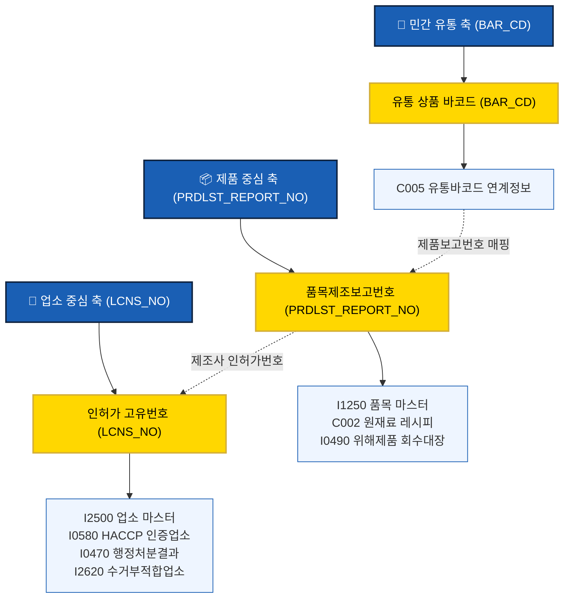

# 📊 식품안전나라 공공데이터 연계성 정밀 분석 보고서
> **RDBMS 스키마와 물리 조인 키(Join Key)를 기반으로 한 공공-민간 초융합 연계 모델 분석**

---

## 🌌 1. 서론 (Introduction)

대한민국 식품의약품안전처(식약처)가 제공하는 **식품안전나라 공공 Open API 169종**은 개별 서비스 관점에서는 훌륭한 정보원이지만, 물리적으로 완전히 파편화(Fragmentation)되어 있습니다. 업소 따로, 제품 따로, 성분 따로 떨어져 있는 데이터를 단일 테이블 조회만으로 실무 서비스에 녹여내기란 불가능에 가깝습니다.

본 분석 보고서는 **RDBMS 물리 설계 관점**에서 169종 데이터 중 핵심 31대 테이블을 식별하고, 이들을 유기적으로 결합하여 거대한 하나의 **‘초융합 식품안전 데이터 모델’**을 완성하기 위한 연계성 구조를 심층 파악합니다.

---

## 🔗 2. 3대 핵심 연계 축 (The Three Core Join Axes)

169종의 복잡한 물리 스키마를 관통하는 핵심 조인 축은 단 **3가지의 공통 연계 고리**로 수렴합니다.



### ① 🏢 업소 중심 축 (인허가 고유번호: `LCNS_NO`)
* **역할**: 전국 모든 식품 공장, 식당, 수입상, 공유주방의 물리적 영업 주체를 규명하는 척추입니다.
* **주요 연계 경로**:
  * **`I2500` (업소마스터)** ➔ **`I0580` (HACCP지정업소)**: 해당 공장의 위생 인증 여부 판별.
  * **`I2500` (업소마스터)** ➔ **`I0470` (행정처분결과)**: 업소의 위법 이력 실시간 감지.
  * **`I2500` (업소마스터)** ➔ **`I2620` (검사부적합)**: 제조업소의 생산 품질 안전성 검증.
  * **`I2500` (업소마스터)** ➔ **`I2856` / `I2857` (푸드트럭 / 공유주방)**: 신산업 업종 규제 현황 연동.

### ② 📦 제품 중심 축 (품목제조보고번호: `PRDLST_REPORT_NO`)
* **역할**: 완제품 단위로 법적 등록 사항, 원재료 성분 배합비, 그리고 실시간 회수/판매 중지 리스크를 엮는 줄기입니다.
* **주요 연계 경로**:
  * **`I1250` (품목마스터)** ➔ **`C002` (원재료 레시피)**: 특정 완제품에 들어간 알레르기 유발 물질 및 모든 성분 추적.
  * **`I1250` (품목마스터)** ➔ **`I0490` (위해식품 회수대장)**: 특정 완제품이 오늘 자 실시간 위해 제품 회수/판매중지 대상인지 감지.
  * **`I1250` (품목마스터)** ➔ **`I2852` (생산중단 정보)**: 해당 상품의 시장 단종 여부 연동.

### ③ 🛒 민간 유통 및 이커머스 축 (바코드: `BAR_CD`)
* **역할**: 공공데이터와 민간 판매망(편의점, 대형마트, 쿠팡)을 0.1초 만에 심리스하게 결합하는 최종 인터페이스입니다.
* **주요 연계 경로**:
  * **`C005` (바코드연계 정보)** ➔ **`I1250` (품목보고)**: 바코드를 매개로 식약처 정식 등록번호(`PRDLST_REPORT_NO`)를 찾아 공공 데이터 대장으로 진입하는 유일한 연결 관문입니다.

---

## 📈 3. 연계 신뢰도(Confidence Level)별 데이터 분류

데이터 결합의 난이도와 무결성 보장 여부에 따라 3단계로 구분하여 연계 신뢰도를 판정합니다.

### 🟢 [HIGH] - 물리적 제약조건 보장 (강한 결합성)
* **특징**: 스키마 구조상 확실한 공통 PK-FK 관계가 형성되어 있어 데이터 소실이 없는 상태.
* **대표 예시**:
  * `I1250` (품목보고) ➔ `I2500` (업소정보) [조인 키: `LCNS_NO`]
  * `C005` (바코드) ➔ `I1250` (품목보고) [조인 키: `PRDLST_REPORT_NO`]
  * `I0470` (행정처분) ➔ `I2500` (업소정보) [조인 키: `LCNS_NO`]

### 🟡 [MEDIUM] - 의미론적 결합 및 전처리 필요 (조건부 결합성)
* **특징**: 명확한 물리적 키가 없거나 데이터 형식 불일치로 인해 텍스트 매핑, 혹은 전처리가 수반되는 결합.
* **대표 예시**:
  * `I1250` (품목보고) ➔ `I2780` (식품영양성분정보)
    * *매핑 방식*: 제품명(`PRDLST_NM`) 또는 식품분류명(`PRDLST_DCNM`)의 텍스트 일부 일치로 결합해야 하므로 정확한 1:1 매칭률이 떨어져, 데이터 정제(Cleansing) 알고리즘이 필요합니다.

### 🔴 [LOW] - 고아 데이터 및 단순 격리 정보 (약한 결합성)
* **특징**: 특정 주제별 업무에 한정되어 타 테이블과의 연계 고리가 희박하고 고립된 데이터.
* **대표 예시**:
  * `I2530` (시험항목코드), 학술 정책 논문 데이터, 식품 안전 FAQ 게시판 정보 등. 
  * 이 데이터들은 일반 통계 분석이나 화면에 가이드라인을 뿌려주는 용도로 개별 호출됩니다.

---

## 🚀 4. 연계성 극대화를 통한 비즈니스 융합 모델

이 강력한 연계성을 조합함으로써 비즈니스에서 독점적 가치를 창출하는 **4대 핵심 사용자 중심 서비스 마트**를 구현했습니다.

```
┌─────────────────────────────────────────────────────────────────────────────┐
│ 1. 바코드 안심 스캔 서비스                                                    │
│    바코드(C005) ➔ 품목보고(I1250) ➔ 원재료(C002) ➔ 회수경보(I0490)              │
│    👉 소비자가 상품 바코드를 스캔하여 0.1초 만에 알레르기/위해여부 판별       │
├─────────────────────────────────────────────────────────────────────────────┤
│ 2. 납품업체 안전 신용 등급 (Risk-Score)                                      │
│    업소정보(I2500) ➔ HACCP인증(I0580) ➔ 위반처분(I0470) ➔ 부적합검사(I2620)     │
│    👉 대형유통사 바이어가 입점 제조사들의 위생리스크를 자동으로 A~D 등급 평정 │
├─────────────────────────────────────────────────────────────────────────────┤
│ 3. 행정동별 클린 위생 안심 요식업 지도                                         │
│    요식업소(I2500) ➔ 상세 주소 GIS(ADDR) ➔ 행정처분(I0470)                    │
│    👉 맛집/배달 플랫폼 상에 위생상태가 우수한 식당에 'Clean 뱃지' 부여        │
├─────────────────────────────────────────────────────────────────────────────┘
```

---

## 💡 5. 결론 및 데이터 가버넌스 제안 (Conclusion)

식품안전나라 169종 데이터는 **"개별로 보면 파편화된 파이프라인이지만, 연계하여 보면 RDBMS 구조로 통합된 거대한 식품안전 유기체"**입니다. 

이를 효과적으로 통제하고 활용하기 위해 다음과 같은 거버넌스 체계를 권장합니다.

1. **데이터 뷰(View)의 선제적 활용**:
   * 애플리케이션 레벨에서 여러 API를 중복 호출해 연산하는 대신, 데이터베이스 레벨에 사전 적재해 둔 **`v_user_barcode_allergy_dataset` 등의 가상 뷰를 적극적으로 쿼리**하여 속도를 보장하고 아키텍처를 슬림하게 유지하십시오.
2. **정기적인 정제 프로세스 구축**:
   * `MEDIUM` 신뢰도 영역의 비정형 텍스트 성분명(예: 대두, 콩, soy의 혼용)과 영양 정보 매핑률을 높이기 위해, 자연어 처리(NLP) 혹은 정규표현식 매핑 파이프라인을 구축하면 결합 신뢰도를 크게 높일 수 있습니다.
