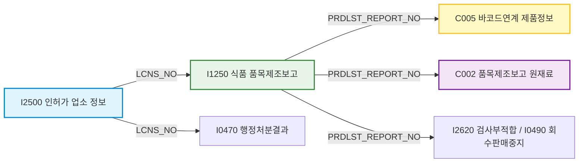
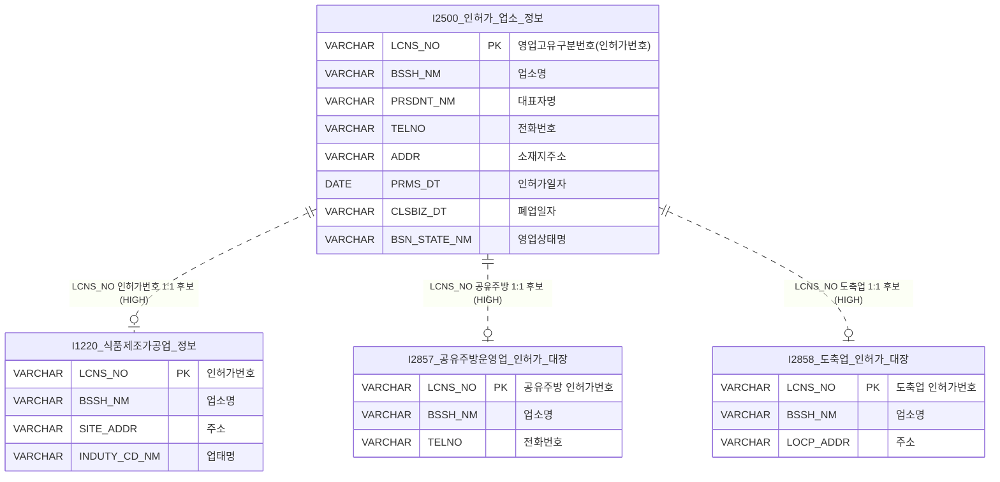
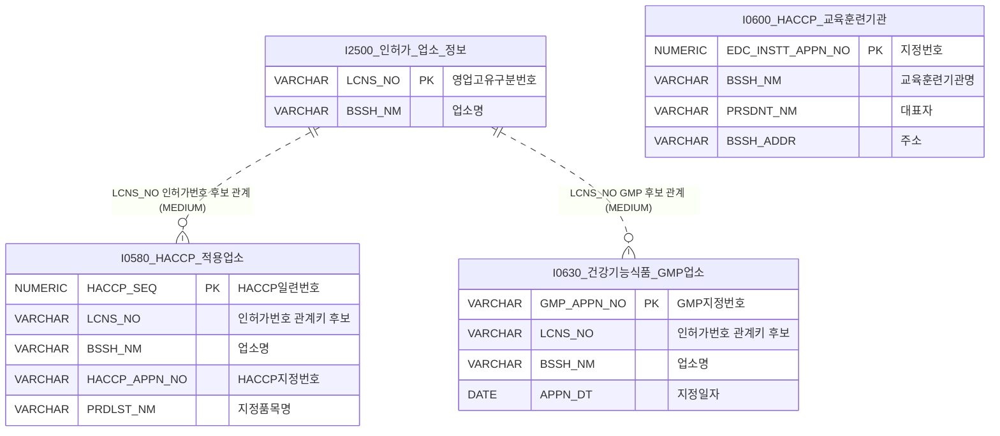
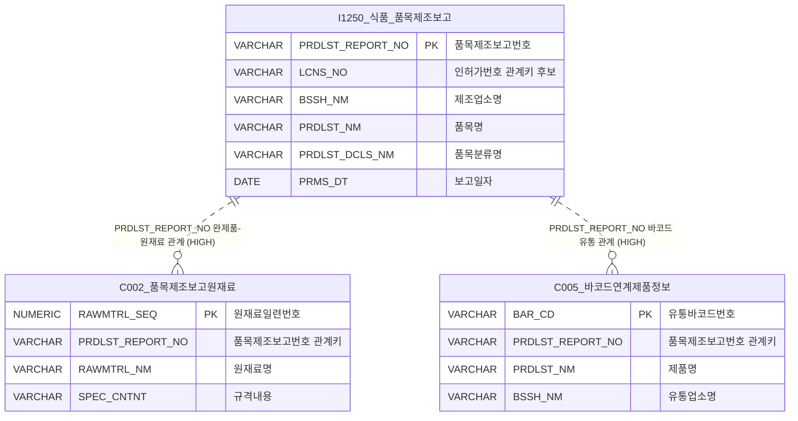
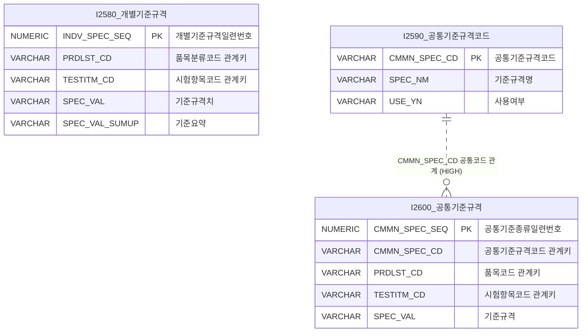
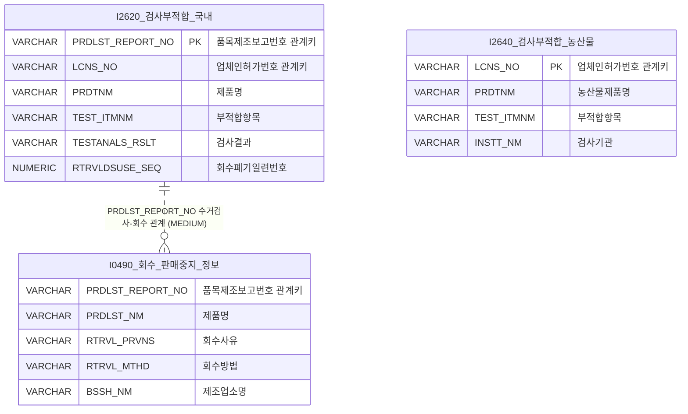
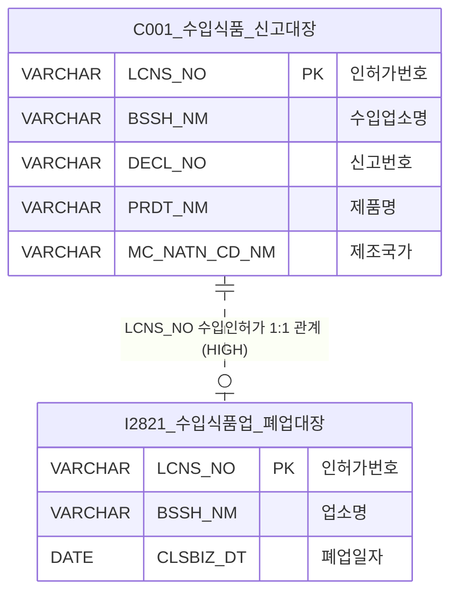
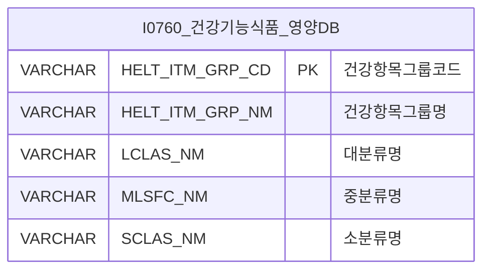
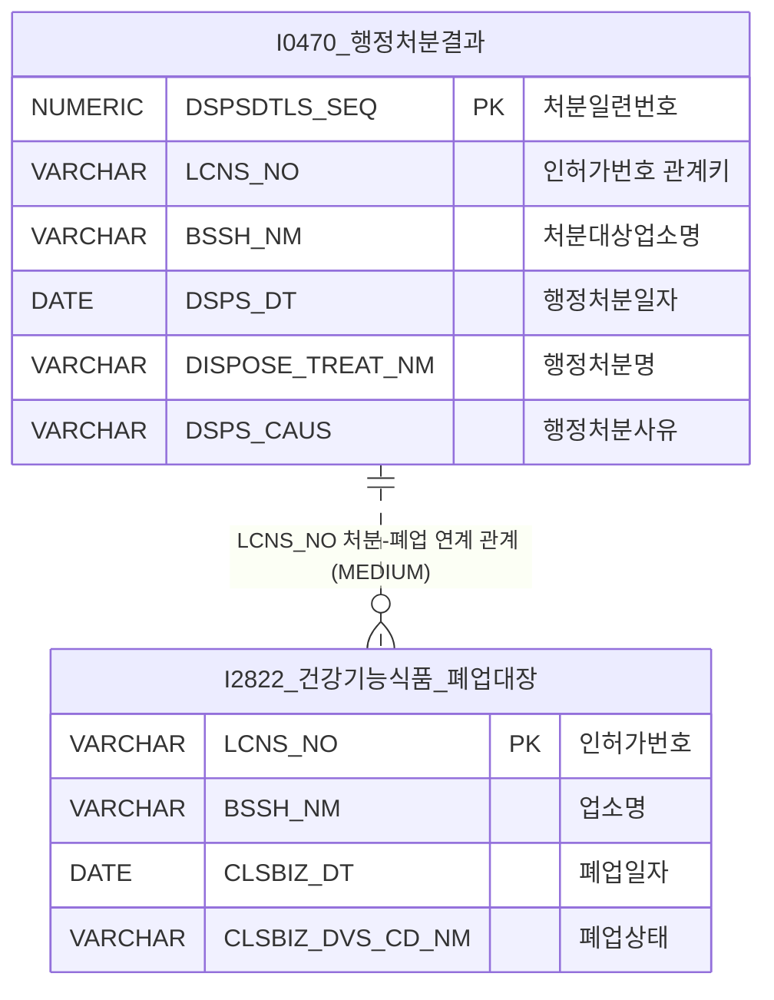
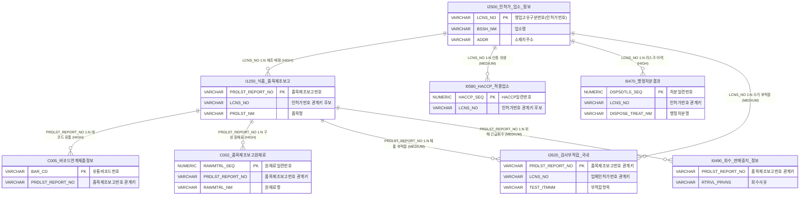

# 🌐 식품안전나라 Open API ERD형 공공데이터 연계 데이터맵 보고서

본 보고서는 식품안전나라가 제공하는 169종의 방대한 OpenAPI 데이터셋을 단순 데이터베이스 물리 스키마 설계를 넘어, **공공데이터의 개방과 융합 및 부가가치 창출(공공데이터 활용 활성화) 관점**에서 한눈에 파악할 수 있도록 도식화한 **ERD형 논리 데이터맵**입니다. 

---

## 1. 📊 전체 데이터맵 요약 (Data Map Executive Summary)

식품안전나라 공공데이터 생태계는 단독 검색 서비스를 넘어, 업소와 제품 및 위해 정보가 유기적으로 연쇄 결합하여 하나의 거대한 **식품 생명주기 그래프(Food Lifecycle Graph)**를 형성하고 있습니다.

* **전체 데이터셋 규모**: 총 169개 OpenAPI 서비스 테이블
* **주요 도메인 분류**: 8개 핵심 비즈니스 도메인
* **핵심 공통 결합키 (Core Integration Keys)**:
  * **인허가번호 (`LCNS_NO`)**: 영업신고 대장, HACCP, 행정처분, 위생점검 등 모든 행정 주체를 연결하는 만능키
  * **품목제조보고번호 (`PRDLST_REPORT_NO`)**: 가공식품, 원재료 성분, 유통 바코드, 부적합 및 회수 대상을 엮어주는 핵심 물류키
  * **바코드번호 (`BAR_CD`)**: 유통 소비망의 바코드와 정부의 인허가 제조 레시피를 이어주는 유일한 민간 융합키
  * **시험항목/품목분류/기준규격코드 (`TESTITM_CD`, `PRDLST_CD`, `CMMN_SPEC_CD`)**: 식품공전 및 개별 규격 검사 체계를 잇는 표준 학술키

### 🔗 주요 연계 흐름 및 시너지 구조

---

## 2. 🗂️ 도메인별 ERD형 데이터맵 (Mermaid specifications)

### 1) 인허가·업소 정보 도메인 (License & Establishments)
전국 모든 식품 취급 업소의 설립, 소재지, 영업 상태를 관장하는 최상위 부모 마스터 도메인입니다.

### 2) HACCP·인증 정보 도메인 (HACCP & Certifications)
식품 제조 위생 안전의 척도가 되는 인증 및 친환경 지정 현황 도메인입니다.

### 3) 품목제조·제품 정보 도메인 (Product Manufacture & Goods)
원재료 레시피와 완성품의 유통 바코드를 품목제조보고번호로 융합하는 핵심 물류 도메인입니다.

### 4) 기준규격·공전 정보 도메인 (Standards & Codes)
모든 검사 및 적합성 판정의 학술적이고 법적인 상하한 기준 기준선을 명시하는 마스터 도메인입니다.

### 5) 검사·부적합·회수 정보 도메인 (Inspection, Non-conformity & Recalls)
국민의 안전 예방과 직접 연계된 실시간 긴급 정보가 누적되는 도메인입니다.

### 6) 수입식품 정보 도메인 (Imported Foods)
해외에서 유입되어 국내 통관 및 검사를 거친 수입 완제품과 원재료 관련 마스터 대장 도메인입니다.

### 7) 영양성분 정보 도메인 (Nutrition)
국민의 식단 관리, 건강 증진 및 헬스케어 서비스를 위해 최적화된 성분표 정보 도메인입니다.

### 8) 행정처분·폐업 정보 도메인 (Administrative Dispositions & Closures)
공장이나 판매점, 음식점들의 부적합 법령 위반 내역과 변경 상태를 추적 관리하는 리스크 도메인입니다.

---

## 3. 🌐 핵심 통합 데이터맵 (Integrated Core Data Map)

식품안전나라의 **가장 큰 부가가치**를 생성하는 3대 연계축(인허가번호, 품목제조보고번호, 바코드)을 기준으로 8개 도메인의 핵심 테이블들을 엮어낸 **공공-민간 초융합형 메가 데이터맵**입니다.

---

## 4. 📝 관계 후보 상세 명세서 (Linkage Candidates Table)

실 데이터상의 값 분포도와 업무 시나리오 상의 강결합 관계를 채점하여 분류한 관계 후보 리스트입니다.

| From 데이터셋 | From 필드 | To 데이터셋 | To 필드 | 관계키 | 신뢰도 | 관계 설명 (활용 가치) | 검증 필요사항 (Data Constraints) |
|---|---|---|---|:---:|:---:|---|---|
| **C002**  (원재료) | `PRDLST_REPORT_NO` | **I1250**  (품목보고) | `PRDLST_REPORT_NO` | **품목제조보고번호** | **HIGH** | 특정 완제품에 탑재된 모든 성분 정보를 원스톱으로 추적·비교하는 최상위 신뢰도 강결합 관계 | 부모 테이블에 보고 번호가 실재하는지 참조 포함률 매칭 테스트 필요 |
| **C005**  (바코드) | `PRDLST_REPORT_NO` | **I1250**  (품목보고) | `PRDLST_REPORT_NO` | **품목제조보고번호** | **HIGH** | 상품 물류 바코드를 스캔하여 실제 등록 신고된 제품의 제원을 고속으로 찾아 들어가는 핵심 징검다리 | 수입식품의 경우 품목보고번호 대신 통관번호 조인 검토 필요 |
| **I1250**  (품목보고) | `LCNS_NO` | **I1220**  (제조가공업) | `LCNS_NO` | **인허가번호** | **HIGH** | 완제품 생산 보고 주체인 업체의 구체적인 관할 기관명과 제조 허가 속성을 매핑하는 부모-자식 관계 | 영업 유형 코드 일치도 검증 |
| **I0470**  (행정처분) | `LCNS_NO` | **I2500**  (업소마스터) | `LCNS_NO` | **인허가번호** | **HIGH** | 법령 위반 처분을 받은 업체의 정식 주소지, 전화번호 및 정상 영업 상태를 실시간 필터링하는 관계 | 처분 일자 시점의 휴폐업 여부 대조 |
| **I0580**  (HACCP) | `LCNS_NO` | **I1220**  (제조가공업) | `LCNS_NO` | **인허가번호** | **MEDIUM** | HACCP을 획득한 업장의 공장 부지 정보 결합용으로 활용 가치가 높으나 실 데이터 불일치가 존재함 | 양 테이블 간 인허가번호 텍스트 누락 비중 점검 |
| **I2620**  (부적합) | `PRDLST_REPORT_NO` | **I1250**  (품목보고) | `PRDLST_REPORT_NO` | **품목제조보고번호** | **MEDIUM** | 정부 수거 검사에서 불합격된 제품의 정확한 제조업체 인허가와 유형 명칭을 획득하기 위한 연계 | 수거 당시 제품명과 신고 제품명의 매칭도 확인 |
| **I0580**  (HACCP) | `BSSH_NM` | **I2500**  (업소마스터) | `BSSH_NM` | **업소명** | **LOW** | 텍스트 업소명을 통한 참고용 단순 연계이나, 특수문자나 띄어쓰기로 인해 조인 시 대량 유실 위험 상존 | 업소명 정제(공백 제거, `(주)` 일괄 정규화) 선행 필수 |

---

## 5. 💡 고부가가치 공공-민간 연계 시나리오 (Linkage Scenarios)

식품안전나라의 ERD형 데이터맵을 활용하여 즉각적으로 비즈니스 모델이나 정책적 편의를 창출할 수 있는 **3대 고부가가치 융합 모델**입니다.

| 활용 목적 | 중심 데이터셋 | 연계 데이터셋 | 사용 공통키 | 활용 예시 (공공데이터 활성화 모델) |
|---|---|---|:---:|---|
| **1. 알레르기 위해 성분 즉각 차단 모바일 가이드** | **C005**  (바코드연계) | **I1250** (품목보고)  **C002** (원재료) | `PRDLST_REPORT_NO` | 소비자가 마트나 학교 급식실에서 간식 바코드를 찍으면, 품목제보고번호를 타고 원재료(`C002`)를 역추적하여 **땅콩, 대두 등 알레르기 유발 물질 포함 유무를 화면에 즉시 적색으로 표시**해 주는 서비스 제공. |
| **2. 불량 제조업체 유통 바코드 차단 및 리스크 경보** | **I0470**  (행정처분결과) | **I1250** (품목보고)  **C005** (바코드연계) | `LCNS_NO`,  `PRDLST_REPORT_NO` | 식약처 수거 검사나 지자체 단속으로 영업정지 등의 행정 처분(`I0470`)을 받은 위해 제조업소 인허가번호를 감지하여, 해당 업소가 유통망에 깔아둔 **모든 유통 바코드(`BAR_CD`) 리스트를 차단 목록으로 도출해 배달 앱 및 물류 플랫폼에 즉시 출고 보류 API로 연계**. |
| **3. 우리 동네 식당 안심 지리 정보 서비스 (GIS Roster)** | **I2500**  (인허가 업소) | **I0580** (HACCP현황)  **I0470** (행정처분결과) | `LCNS_NO` | 지자체 맛집 지도 서비스 위에 정식 구청 인허가 대장(`I2500`) 정보를 결합해 **HACCP 지정 업소는 금색 핀(Pin)**으로, **최근 3개월 내 행정 처분 이력이 있는 업소는 적색 주의 핀**으로 지도에 시각화하여 국민의 동네 안심 먹거리 탐색권 보장. |

---

## 6. ⚠️ 데이터맵 활용 시 주의사항 (Critical Caveats)

1. **본 데이터맵은 자동 분석에 기반한 '논리 데이터맵 초안'입니다**
   * 본 명세는 crawl_cache.json의 메타데이터와 대량 적재 캐시 데이터의 공통 키 관계를 엄밀히 진단하여 도출한 논리적 청사진입니다. 실무 쿼리 가동 시 예외 처리가 가미되어야 합니다.
2. **PK/FK는 실제 참조 무결성이 검증된 확정 관계가 아니라 '비즈니스적 후보 관계'입니다**
   * 공공 API 원본 데이터 특성상 참조 무결성이 완전하게 강제되어 공급되지 않습니다. 예컨대 자식 행정처분 대장에는 처분받은 인허가번호가 존재하지만, 부모 업소 대장의 과거 연도 누락으로 인해 조인이 실패하는 고아 레코드(Orphaned Row)가 발생합니다. 따라서 **`INNER JOIN` 시 데이터 소실이 심각할 수 있으므로 상용 구현 시 `LEFT OUTER JOIN` 채택을 권장**합니다.
3. **설명성 한글 필드(이름, 주소, 대표자명 등)는 연계키로 절대 신봉해서는 안 됩니다**
   * `BSSH_NM`(업소명)이나 `ADDR`(주소) 필드는 정부 보고 시점의 띄어쓰기 한 칸 차이, 한문 및 특수기호 삽입 등으로 인하여 실제 쿼리 조인 결합률이 현격하게 떨어지는 **LOW 등급 관계**입니다. 이들은 단순 키워드 검색 와일드카드(`LIKE %...%`)나 대시보드 출력 텍스트용으로만 사용하고, 관계의 연결고리로는 반드시 시스템 고유 코드(`LCNS_NO`, `PRDLST_REPORT_NO` 등)만 활용하십시오.
4. **실 서비스 론칭 전 "4종 무결성 자가 진단" 필수**
   * 공공-민간 초융합형 실시간 서비스를 실제 상용 배포하기 전에는 반드시 데이터의 **유일성(Unique), 결측률(Null Ratio), 중복률(Redundancy), 그리고 OpenAPI 서버 갱신 주기를 감안한 동기화 최신성(Freshness) 검증** 단계가 아키텍처에 구현되어야 합니다.
